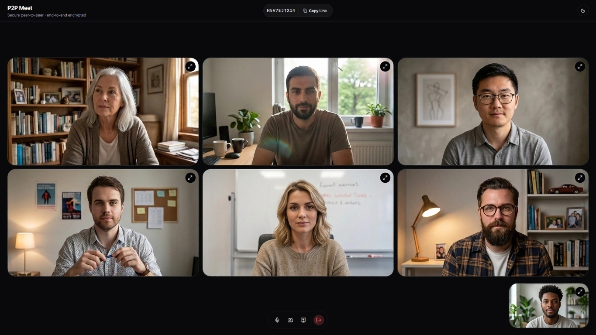

# P2P Meet

A peer-to-peer video conferencing application built with Trystero, React, TypeScript, Vite and shadcn/ui.
<br>
P2P Meet enables secure, end-to-end encrypted video calls without relying on central servers for media transmission.



## Features

- Peer-to-peer video and audio communication
- Secure connections with end-to-end encryption
- Room-based meeting system with shareable links
- Screen sharing capabilities
- Audio activity indicators
- Camera and microphone controls
- Dark/Light theme toggle
- Responsive design  

## Technology Stack

- **Framework**: React 19 with TypeScript
- **Build Tool**: Vite with React Compiler
- **Styling**: shadcn/ui — Tailwind CSS
- **Icons**: Lucide React
- **Peer-to-Peer**: Trystero
- **State Management**: React hooks (useState, useEffect, useRef)
- **Linting**: Oxlint with TypeScript-aware rules

## Getting Started

### Prerequisites

- Node.js 22.12+
- npm or yarn
- Modern web browser with WebRTC support

### Installation

1. Clone the repository:
   ```bash
   git clone https://github.com/temokoki/P2P_Meet
   cd p2p-meet
   ```

2. Install dependencies:
   ```bash
   npm install
   ```

### Development

To start the development server:
```bash
npm run dev
```

The application will be available at `http://localhost:5173`.

### Building for Production

To create a production build:
```bash
npm run build
```

To preview the production build:
```bash
npm run preview
```

## Usage

### Starting a Meeting

1. Launch the application
2. Click "Start New Meeting" to create a new room
3. Share the generated room ID or link with participants
4. Grant camera and microphone permissions when prompted
5. Use the controls at the bottom to manage your camera, microphone, and screen sharing

### Joining a Meeting

1. Launch the application
2. Enter the room ID provided by the host
3. Click "Join"
4. Grant camera and microphone permissions when prompted
5. Use the controls to manage your media devices

### Controls

- **Microphone**: Toggle mute/unmute
- **Camera**: Turn video on/off
- **Screen Share**: Share your entire screen or application window
- **Leave**: Exit the meeting and return to the landing page
- **Copy Link**: Copy the current meeting URL to share with others
- **Theme**: Toggle between light and dark themes

## How It Works

P2P Meet establishes direct peer-to-peer connections between participants using WebRTC. When a user creates or joins a room:

1. A signaling connection is established via Trystero to exchange connection metadata
2. Direct media connections are established between peers for audio/video streams
3. Media streams are exchanged directly between browsers without intermediaries
4. Screen sharing follows the same peer-to-peer pattern
5. All media is encrypted end-to-end

## Security

- All media streams are encrypted using WebRTC's built-in encryption
- Signaling metadata is exchanged via Trystero with end-to-end encryption
- No media ever passes through external servers
- Application requires HTTPS or localhost for media access (browser requirement)

## Project Structure

```
src/
+-- components/
    +-- ui/              # Reusable UI components (buttons, inputs, cards, etc.)
    +-- mode-toggle.tsx      # Theme toggle component
    +-- theme-context.tsx    # Theme context and hook
    L-- theme-provider.tsx   # Manages and applies theme
+-- lib/
    L-- utils.ts           # Utility functions
+-- App.tsx                # Main application component
+-- index.css              # Global styles
L-- main.tsx               # Application entry point
```

## Browser Support

P2P Meet works in modern browsers that support WebRTC:
- Chrome
- Edge
- Firefox
- Safari

Note: Safari and Firefox may require enabling certain experimental features for optimal screen sharing performance.

## Development Guidelines

This project uses:
- ESLint with Oxlint for code quality
- TypeScript for type safety
- React Compiler for optimized builds
- Tailwind CSS for utility-first styling

To lint the codebase:
```bash
npm run lint
```

## License

This project is open source and available under the MIT License.
